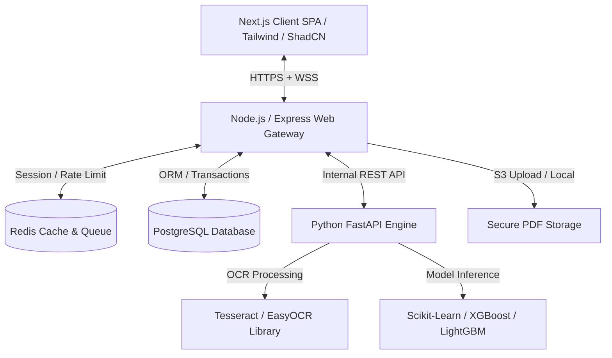
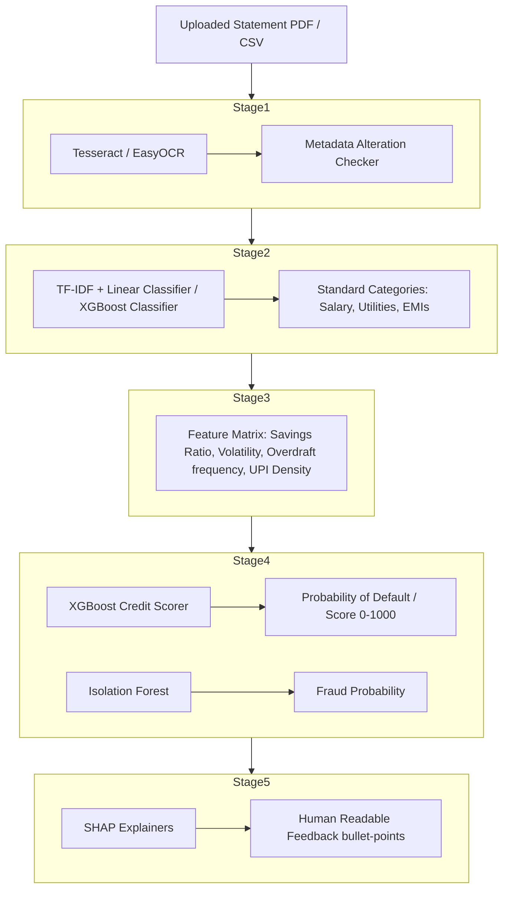

# System Architecture & Technical Design Document
## Alternative Credit Assessment Platform (v1.0)

This document describes the end-to-end software architecture, service orchestration, folder structures, AI modeling pipelines, security mechanisms, and development roadmap.

---

## 1. System Overview & Component Diagram

The platform utilizes a modern microservice-inspired architecture designed to run on containerized infrastructure (Docker / AWS).



### Key Components:
1. **Frontend Application**: Next.js single-page web app. Leverages Framer Motion for premium micro-animations and Recharts for interactive financial analytics.
2. **Backend API Gateway**: Node.js & Express API written in TypeScript. Manages access control, JWT verification, document lifecycle, business logic, and lender workflow queues.
3. **Python AI Service**: Python FastAPI service. Handles CPU/GPU intensive workloads like OCR text extraction, NLP-based transaction classification, XGBoost credit scoring, and SHAP explainability.
4. **Database & Cache**: PostgreSQL for ACID transactional data (Users, Transactions, Audit Logs) via Prisma ORM. Redis handles caching, auth rate-limiting, and short-term job queue states.

---

## 2. Directory & Repository Structure

We will adopt a structured monorepo design layout. This keeps all components under a single repository, making local orchestration and builds highly efficient.

```
alternative-credit-assessment/
├── .github/
│   └── workflows/
│       ├── build-frontend.yml
│       ├── build-backend.yml
│       └── build-ai-service.yml
├── docs/
│   ├── prd.md
│   └── architecture.md
├── apps/
│   ├── web/                     # Next.js Frontend
│   │   ├── src/
│   │   │   ├── components/      # UI components (ShadCN, custom UI)
│   │   │   ├── hooks/           # React hooks
│   │   │   ├── pages/           # Next.js routing pages
│   │   │   ├── styles/          # Tailwind config and index.css
│   │   │   └── utils/           # Helper functions
│   │   ├── package.json
│   │   └── tsconfig.json
│   ├── backend/                 # Node.js / Express API Gateway
│   │   ├── src/
│   │   │   ├── controllers/     # Route handlers
│   │   │   ├── middleware/      # Auth, validator, rate-limiter, security
│   │   │   ├── prisma/          # Prisma schema and seeders
│   │   │   ├── routes/          # Express route bindings
│   │   │   └── app.ts           # Server setup
│   │   ├── package.json
│   │   └── tsconfig.json
│   └── ai-service/              # Python FastAPI AI / ML Service
│       ├── app/
│       │   ├── core/            # Config, security, ML pipelines
│       │   ├── models/          # Trained Scikit-learn/XGBoost weight files
│       │   ├── routers/         # API routing
│       │   ├── services/        # OCR, Transaction parser, credit score engine
│       │   └── main.py          # FastAPI startup
│       ├── requirements.txt
│       └── Dockerfile
├── docker/                      # Development & Production orchestrations
│   ├── docker-compose.yml
│   └── docker-compose.prod.yml
├── package.json                 # Monorepo workspaces settings
└── README.md
```

---

## 3. AI & ML Model Pipeline

The credit scoring process takes raw user inputs and outputs an explainable creditworthiness rank.



### Pipeline Overview:
* **Stage 1 (OCR)**: Parse text fields from raw PDFs/images. Check signature hashes and metadata creation-dates for tampering to flag fraud.
* **Stage 2 (NLP Classification)**: Map transaction descriptions (e.g. `UPI-ZOMATO-187@okaxis`) into standard labels (e.g., Food/Dining).
* **Stage 3 (Feature Engineering)**: Compute mathematical aggregates:
  * `savings_ratio` = (Total Income - Total Expenses) / Total Income
  * `upi_frequency` = Total UPI transaction counts per month
  * `bounce_events` = Overdraft / NSF transactions counts
  * `debt_to_income` = Total existing EMIs / Total regular salary
* **Stage 4 (Inference)**: Feed variables into a pre-trained XGBoost regressor mapping to a `0-1000` alternative credit score.
* **Stage 5 (Explainability)**: Run a local linear explainer or SHAP parser to extract the primary positive and negative weight contributors, translating them to localized feedback (e.g., "Your utility bill payment discipline boosted your score by 45 points").

---

## 4. Security & Compliance Architecture

FinTech applications must enforce top-tier cybersecurity controls to protect personal financial data, complying with India's **Digital Personal Data Protection (DPDP) Act**:

1. **Data Security**:
   * **In-Transit**: TLS 1.3 encryption forced on all client-server communication.
   * **At-Rest**: AES-256 encryption applied to sensitive files (statements, raw transaction dumps).
   * **Database**: Sensitive identifiers (PAN card, bank account numbers) hashed with salted SHA-256 or encrypted before storage.
2. **Access Control**:
   * JWT (JSON Web Tokens) with a short 15-minute lifespan stored in `httpOnly` secure cookies.
   * Role-Based Access Control (RBAC) separating Borrower interfaces from Lender management panels.
3. **Application Defense**:
   * Rate limiting at the Gateway level (Redis-backed sliding window) to prevent brute-force attacks.
   * Parameter validation (using packages like `zod`) to shield against SQL injection, XSS, and CSRF.
4. **DPDP Compliance**:
   * Explicit, clear consent check-boxes prior to uploading statements.
   * "Right to be Forgotten" implementation allowing users to request complete deletion of uploaded transaction records and profile scores.
   * Localized data storage restricting bank records to servers physically hosted in Indian regions (e.g., AWS `ap-south-1` Mumbai).

---

## 5. 30-Day Development Roadmap

| Phase | Days | Focus Area | Deliverables |
|---|---|---|---|
| **Phase 1** | Days 1–3 | Planning & Specs | Complete PRD, Figma Wireframes, Design Architecture. *(Complete)* |
| **Phase 2** | Days 4–6 | Environment Setup | Monorepo initialization, Docker setup, CI pipeline draft. *(Current)* |
| **Phase 3** | Days 7–10 | Relational Database | Schema migration, seeding dummy transaction history data. |
| **Phase 4** | Days 11–16 | Backend Services | Auth, File Upload routes, Express-FastAPI service hookups. |
| **Phase 5** | Days 17–22 | Frontend Core | Responsive components, Recharts dashboards, Tailwind setup. |
| **Phase 6** | Days 23–26 | Machine Learning | OCR statement parser, XGBoost training, Explainable AI engine. |
| **Phase 7** | Days 27–28 | Testing & Q&A | Integration testing, coverage metrics, load testing. |
| **Phases 8–10**| Days 29–30 | Deploy & Presentation| Docker production bundle, README manuals, Pitch Deck outline. |

---

## 6. GitHub Commit Plan

To maintain clear history and collaborative hygiene, we will utilize the following Git flow:

### Branching Policy
* `main`: Protected production branch. Deployments run directly from updates to this branch.
* `develop`: Integration branch where all feature branches converge.
* `feature/*`: Short-lived branches dedicated to individual modules (e.g., `feature/ocr-parser`, `feature/auth-jwt`).

### Git Commit Conventions
We will adhere to Semantic Commit messages:
* `feat`: A new feature (e.g., `feat(backend): add bank statement upload endpoint`)
* `fix`: A bug fix (e.g., `fix(ocr): resolve pdf multi-page parser crash`)
* `docs`: Documentation changes only
* `style`: Code style changes (formatting, missing semi-colons)
* `refactor`: Refactoring code that neither fixes a bug nor adds a feature
* `test`: Adding missing tests or correcting existing tests
