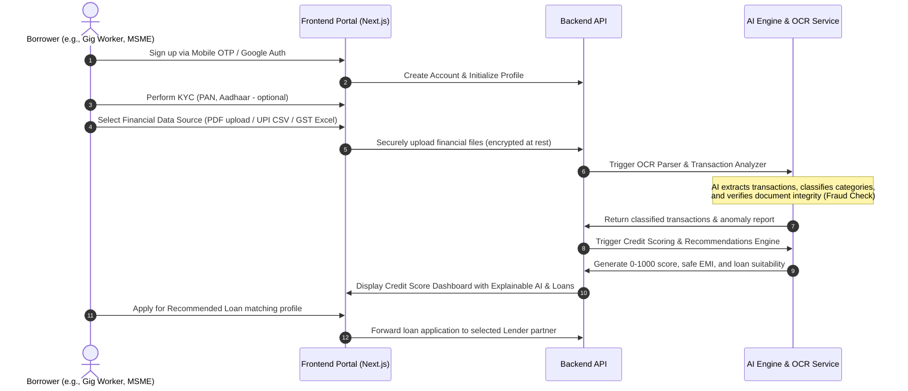
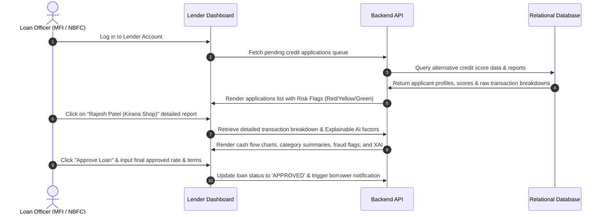

# Product Requirement Document (PRD)
## Alternative Credit Assessment Platform for Financial Inclusion (v1.0)

This document details the product strategy, target demographics, user journeys, technical scope, and business models for the Alternative Credit Assessment Platform. The goal of this platform is to bridge the credit gap for "credit invisible" segments in India.

---

## 1. Executive Summary & Objective

In India, over 150 million individuals and small businesses are excluded from the formal credit ecosystem due to the lack of a traditional credit score (such as a CIBIL score). Traditional underwriting heavily prioritizes past loan repayment history, which gig workers, freelancers, farmers, street vendors, and MSMEs rarely have. 

Our platform analyzes verified non-traditional financial transactions—such as UPI records, bank statement PDFs, digital wallet logs, GST receipts, and utility/telecom bill payments—to generate an AI-powered **Alternative Credit Score (0-1000)** and a granular financial stability analysis. 

### Core Value Propositions
* **For Borrowers**: Access to formal credit at reasonable rates by proving financial responsibility through daily/monthly cash flows.
* **For Lenders (Banks/NBFCs/MFIs)**: Lower default rates and tapping into a massive unserved market using ML-driven fraud detection, repayment forecasting, and explainable risk profiles.

---

## 2. User Personas

### Persona A: The Kirana Shop Owner (MSME)
* **Name**: Rajesh Patel
* **Location**: Pune, Maharashtra
* **Business**: Patel General Store (Grocery shop)
* **Financial Profile**: Cash-heavy business but increasingly accepts digital payments (UPI QR code on GPay/PhonePe). No formal business loans or CIBIL history.
* **Pain Point**: Wants a loan of ₹2,00,000 to purchase inventory for festive seasons. Traditional banks reject him because his business tax filing is minimal and he lacks collateral or a CIBIL score.
* **Platform Utility**: Uploads his monthly business UPI statement and GST filings to demonstrate strong, consistent cash flow and high utility repayment consistency, securing an alternative credit profile.

### Persona B: The Gig Worker / Delivery Partner
* **Name**: Amit Kumar
* **Location**: Delhi NCR
* **Business**: Zomato Delivery Partner & Uber Moto Rider
* **Financial Profile**: Receives weekly payouts from gig platforms. Pays monthly rent of ₹6,000 via UPI. Pays electricity bill on time. No credit card or existing loan history.
* **Pain Point**: Needs ₹25,000 to repair his two-wheeler. Online micro-lenders offer exorbitant interest rates (36%+ APR).
* **Platform Utility**: Links his digital wallet statement and bank statements showing frequent, small transactions and regular, predictable weekly payouts to qualify for a low-interest micro-loan.

### Persona C: The Freelance Digital Creator
* **Name**: Priya Nair
* **Location**: Bangalore, Karnataka
* **Business**: Freelance UI/UX Designer & Content Writer
* **Financial Profile**: High-value irregular payments from multiple domestic and international clients. Maintains a high average bank balance but has zero credit utilization history.
* **Pain Point**: Needs a car loan of ₹6,00,000. Traditional banks classify her as "high-risk, unstable income" because she doesn't have regular payslips.
* **Platform Utility**: Uses the platform to combine multiple bank statements, GST invoices, and tax receipts. The AI detects her high savings trend and stable quarterly average income to approve her creditworthiness.

### Persona D: The MFI / NBFC Credit Officer
* **Name**: Ramesh Sharma
* **Location**: Jaipur, Rajasthan
* **Role**: Senior Loan Underwriter at a regional Microfinance Institution (MFI)
* **Pain Point**: Spends hours manually analyzing bank statement PDFs, Excel sheets, and transaction logs. Fears document fraud (forged bank statements) and struggles to justify loans for thin-file clients to the credit committee.
* **Platform Utility**: Reviews the platform’s unified Lender Dashboard. Uses the AI-analyzed cash flow trend, automated document integrity checks, fraud probability score, and Explainable AI (XAI) bullet points to confidently approve or deny loans within minutes.

---

## 3. User Journeys

### 3.1 Borrower Journey (Web/Mobile App Flow)


### 3.2 Lender Journey (Underwriter Review Flow)


---

## 4. Information Architecture (IA)

The application features a split workspace based on user roles: **Borrower Portal** and **Lender/Admin Portal**.

```mermaid
graph TD
    %% Base Site Root
    Root[Home/Landing Page] --> Login[Login/Signup Page]
    Root --> Features[Features Page]
    Root --> Pricing[Pricing & Plans]
    Root --> FAQ[FAQ & Contact]
    
    %% Authentication Redirect
    Login --> AuthCheck{Check Role}
    
    %% Borrower Portal
    AuthCheck -->|Borrower| BP[Borrower Portal]
    BP --> BD[Dashboard]
    BD --> BD1[Alternative Credit Score & Health Meters]
    BD --> BD2[Income Stability & Savings Trends]
    BD --> BD3[Loan Eligibility Quick Summary]
    
    BP --> BU[Upload Center]
    BU --> BU1[PDF Bank Statements]
    BU --> BU2[UPI History / CSVs]
    BU --> BU3[GST / Invoices]
    BU --> BU4[OCR Receipt Upload]
    
    BP --> BA[Analytics Hub]
    BA --> BA1[Income vs Expense Breakdown]
    BA --> BA2[Cash Flow Charts]
    BA --> BA3[Recurring Subscriptions & EMIs]
    
    BP --> BR[Loan Recommendations]
    BR --> BR1[Available Offers]
    BR --> BR2[Repayment Simulators / EMI Calculators]
    
    BP --> BC[AI Chatbot Support]
    
    BP --> BSet[Profile & Settings]
    
    %% Lender & Admin Portal
    AuthCheck -->|Lender/Admin| LP[Lender / Admin Portal]
    LP --> LD[Lender Dashboard]
    LD --> LD1[Application Queue]
    LD --> LD2[Overall Portfolio Risk Meter]
    
    LP --> LA[Applicant Details Panel]
    LA --> LA1[Alternative Credit Score Analyzer]
    LA --> LA2[Explainable AI Bullet Points]
    LA --> LA3[Fraud Probability & Risk Metres]
    LA --> LA4[Verification Docs Explorer]
    
    LP --> AM[Admin Panel Settings]
    AM --> AM1[User Management]
    AM --> AM2[Partner Lenders Control]
    AM --> AM3[Audit Logs & Fraud Alerts System]
```



---

## 5. Wireframe & UI Layout Specifications

The user interface will be built with a **Premium, High-Contrast Dark Theme** (sleek and sophisticated) which elevates the platform's appearance and sets a modern fintech tone. 

### 5.1 Borrower Dashboard Wireframe Layout
```
+-----------------------------------------------------------------------------------+
|  [Logo] CredInd       (Search...)                   [Chatbot]  [Alerts]  [Profile]|
+-----------------------------------------------------------------------------------+
|  (Sidebar)      |  Welcome back, Rajesh Patel!                   [Active Role: User] |
|                 |  +------------------------------------------------------------+ |
|  [Dashboard]    |  |  YOUR ALTERNATIVE CREDIT SCORE                             | |
|  [Upload Docs]  |  |  +------------------------------------------------------+  | |
|  [Transactions] |  |  |       [=== 745 / 1000 ===] Excellent Credit          |  | |
|  [Analytics]    |  |  +------------------------------------------------------+  | |
|  [Loan Offers]  |  |  Explainable AI Factors:                                   | |
|  [AI Chatbot]   |  |   ✔ Cash flow is highly consistent (Score: 89/100)        | |
|  [Settings]     |  |   ✔ UPI transaction frequency is growing month-over-month | |
|                 |  |   ✔ Zero bank account overdrafts in the last 180 days      | |
|                 |  +------------------------------------------------------------+ |
|                 |                                                                 |
|                 |  +---------------------------+  +-----------------------------+ |
|                 |  | Income Stability Score    |  | Monthly Savings Trend       | |
|                 |  | [||||||||||||.......] 72% |  | [Area Chart: Income vs Exp] | |
|                 |  +---------------------------+  +-----------------------------+ |
|                 |                                                                 |
|                 |  +------------------------------------------------------------+ |
|                 |  | Recommended Loan Offers                                    | |
|                 |  | * MFI Growth Loan: up to ₹2,500,000 @ 14% APR (Tenure: 12m)| |
|                 |  | * Kirana Working Capital: up to ₹1,50,000 @ 12% APR (30-day)| |
|                 |  +------------------------------------------------------------+ |
+-----------------------------------------------------------------------------------+
```

### 5.2 Lender Dashboard Wireframe Layout
```
+-----------------------------------------------------------------------------------+
|  [Logo] CredInd - Partner Portal                     [Search Apps]       [Profile]|
+-----------------------------------------------------------------------------------+
|  (Sidebar)      |  Pending Loan Underwriting Queue                                |
|                 |  +------------------------------------------------------------+ |
|  [Dashboard]    |  | Search Applicants...                  [Filter by Risk Rank] | |
|  [Queue]        |  +------------------------------------------------------------+ |
|  [Risk Engine]  |  | Applicant         | Alt Score | Risk Band | Fraud Prob | Action| |
|  [Lenders list] |  +------------------------------------------------------------+ |
|  [Audit Logs]   |  | Rajesh Patel      |    745    | Low Risk  |    2%      | [View]| |
|  [Settings]     |  | Amit Kumar        |    610    | Med Risk  |    5%      | [View]| |
|                 |  | Priya Nair        |    820    | Low Risk  |    1%      | [View]| |
|                 |  | Chetan (Street V) |    450    | High Risk |   35%      | [View]| |
|                 |  +------------------------------------------------------------+ |
|                 |                                                                 |
|                 |  Selected Applicant Details: Rajesh Patel                       |
|                 |  +----------------------------+  +----------------------------+ |
|                 |  | AI Decision Engine Notes   |  | Verification Documents     | |
|                 |  | * Debt Burden: 28% (Safe)  |  | [Download PDF Statement]   | |
|                 |  | * Fraud probability: 2%    |  | [GST Verification: Green]  | |
|                 |  | * Monthly Average Bal: ₹45K|  | [UPI Transaction CSV Link] | |
|                 |  +----------------------------+  +----------------------------+ |
+-----------------------------------------------------------------------------------+
```

---

## 6. Design System & Branding

The user interface will be developed with visual excellence, micro-animations, and sleek dark modes.

### 6.1 Color Palette
To create a premium and trustworthy Fintech appearance, we will use a curated palette:
* **Primary / Accent Color**: Deep Emerald Green (`#10B981` / `#059669` / `#064E3B` in tailwind)
  * *Rationale*: Green represents money, wealth, growth, and trust in financial contexts.
* **Secondary Color**: Vivid Indigo (`#6366F1` / `#4F46E5`)
  * *Rationale*: Adds a high-tech modern AI feel to standard credit indicators.
* **Neutral Background (Dark Mode)**: Slate/Charcoal (`#0B0F19` / `#111827`)
  * *Rationale*: Lowers eye strain and feels premium, letting key indicator colors pop.
* **Neutral Surface (Dark Mode)**: Light Slate (`#1F2937` / `#374151`)
  * *Rationale*: Creates high-contrast cards and blocks.
* **Alert / Risk Colors**:
  * *Low Risk (Safe)*: Mint (`#34D399`)
  * *Medium Risk (Moderate)*: Amber (`#F59E0B`)
  * *High Risk (Critical)*: Crimson (`#EF4444`)

### 6.2 Typography
* **Heading Font**: **Outfit** (Google Font)
  * *Rationale*: A geometric sans-serif that looks extremely clean and modern for titles and scores.
* **Body Font**: **Inter** (Google Font)
  * *Rationale*: Exceptional readability for numbers, financial statements, and descriptive lists.

### 6.3 Logo Ideas
* **Concept 1: The Rising Arrow (CredInd)**
  * *Description*: A stylized Indian map silhouette combined with an upward-pointing arrow made of digital nodes, reflecting financial growth.
* **Concept 2: The Digital Trust Seal**
  * *Description*: A shield shape composed of overlapping green (trust) and indigo (technology) lines, forming a central lowercase "c" with a checkmark.

---

## 7. Business & Revenue Models

Our platform is designed as a B2B2C / B2B SaaS system, aligning incentives across borrowers and financial institutions.

### 7.1 Revenue Streams
1. **Pay-per-Pull API Fee (B2B)**
   * Banks and NBFCs pay a transaction fee (ranging from ₹10 to ₹50 per query) to query a user's alternative credit score and receive the comprehensive risk report.
2. **Monthly SaaS Subscription (B2B)**
   * MFIs and local cooperative banks pay a recurring tier-based software subscription (e.g., ₹15,000/month per branch) to access the Lender Dashboard, custom scoring model tuning, and document OCR systems.
3. **Disbursal Commission / Referral Fee (B2C / B2B2C)**
   * The platform acts as an eligible lead generator. For every user that takes a recommended loan, the partner bank/NBFC pays us 0.5% - 1.5% of the loan amount as a payout.
4. **Premium User Portfolio Diagnostics (B2C - Optional)**
   * Borrowers can pay a small, one-off fee (e.g., ₹99) to get detailed recommendations and simulation reports on how to optimize their UPI transaction habits and payment behaviors to increase their score.

---

## 8. Future Scope & India Stack Integrations

The platform is designed to scale with India's evolving digital financial infrastructure:

1. **Account Aggregator (AA) Framework integration (Sahamati)**:
   * Instead of manual PDF file uploads (which can be forged or are slow to process), the platform will integrate with the licensed Account Aggregators (e.g., Anumati, OneMoney) to securely retrieve bank statement data instantly via consent-based APIs.
2. **Open Credit Enablement Network (OCEN) integration**:
   * Integrate directly with OCEN protocols to allow MSMEs to receive loan offers, undergo underwriting, and receive disbursements inside any borrower-facing application.
3. **Automated Utility & Telecom Bill Scraping**:
   * Partner with Bharat Bill Payment System (BBPS) to pull electricity, water, and broadband billing records instantly to prove payment discipline.
4. **Socio-Behavioral Analytics (Alternative Data)**:
   * Evaluate shipping data from e-commerce platforms (Amazon, Flipkart) or delivery ratings on gig platforms (Zomato, Swiggy) to measure business integrity and work ethic.
